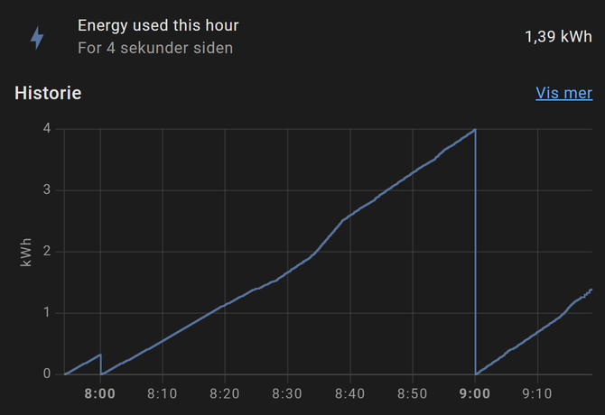
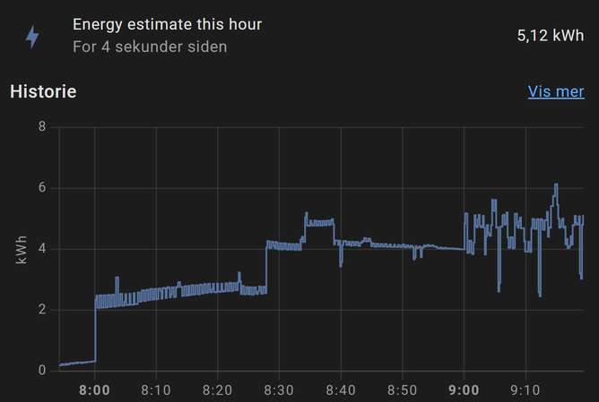
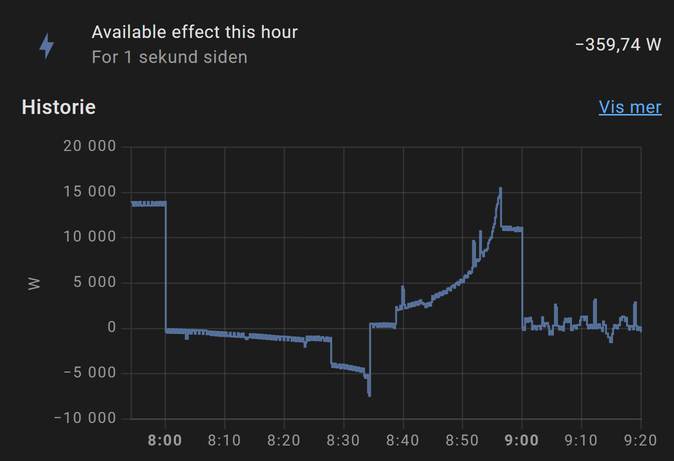

# EnergyTariff


## Description

This integration adds a platform entity that provides sensors to monitor energy consumption.
In order to use this in a meaningful way, a meter reader for the total power usage of the HA installation is needed,
typically this means that you have a meter reader installed on your AMS meter.

## Installation

This sensor can either be installed manually, or via HACS(recommended)

### Manual install

1.  Open the folder containing your HA install, and locate the config folder.  It will contain a file called (`configuration.yaml`)
2.  If there is not a subfolder in config folder called `custom_components`, create it.
3.  Inside `custom_components` folder, create a new folder named `energytariff`
4.  Download all files from `custom_components/energytariff/` in this repository and put them in `energytariff`-folder
5.  Restart HA

### HACS(anbefalt)

Go to HACS -> Integrations, click the blue + sign at the bottom right of the screen.
Search for `EnergyTariff` and install it as any other HACS component.


## Configuration

Configuration of this sensor is done in yaml.
Minimal example: `configuration.yaml` :

```yaml
sensor:
  - platform: energytariff
    entity_id: "sensor.ams_power_sensor_watt"
    target_energy: 10
```

### Configuration schema

| Name | Type | Default | Since | Description |
|------|------|---------|-------|-------------|
| entity_id | string | **required** | v0.0.1 | entity_id for your AMS meter sensor that provides current power usage. |
| precision | int | 2 | v0.0.1 | Number of decimals to use in rounding.  Defaults to 2, giving all sensors two decimals. |
| target_energy | float | None | v0.0.1 | Target energy consumption in kWh.  See sensor "Available power this hour" for more detailed description. |
| max_power | float | None | v0.0.1 | Max energy(in kWh) reported by "Available power this hour" sensor.See sensor "Available power this hour" for more detailed description. |
| levels | list | None | v0.0.1 | Grid energy levels(primarily for norwegian HA users).  If your energy provider has tariffs based on energy consumption per hour, this list of levels can be utilized.

#### Levels schema

If your electric energy provider uses grid capacity levels, these can be configured.
Per entry, here is the values needed:

| Name | Type | Default | Since | Description |
|------|------|---------|-------|-------------|
| name | string | **required** | v0.0.1 | Name of grid energy level |
| threshold | float | **required** | v0.0.1 | Energy threshold level, in kWh |
| price | float | **required** | v0.0.1 | Energy level price |

Levels example:

```yaml

levels:
  - name: "Trinn 1: 0-2 kWh"
    threshold: 2
    price: 135
  - name: "Trinn 2: 2-5 kWh"
    threshold: 5
    price: 170
```


For a complete configuration example, see [full example](examples/full.yaml)

## Sensors

This integration provides the following sensors:

| Name | Unit | Description |
|------|------|-------------|
| Energy used this hour | kWh | Total amount of energy consumed this hour.  Resets to zero at the start of a new hour. |
| Energy estimate this hour | kWh | Energy estimate this hour.  Based on energy consumption so far + current_power * remaining_seconds |
| Available power this hour | W | How much power that can be used for the remaining part of hour and still remain within threshold limit, either configured in `target_energy` setting or at the configured grid level threshold(`level` threshold). |
| Average peak hour energy | kWh | The highest hourly consumption, measured on three different days.  Used to calculate grid energy level.  Resets every month. |

Additionally, if `levels` are configured, the following sensors are added:

| Name | Unit | Description |
|------|------|-------------|
| Energy level name | string | Name of current energy level |
| Energy level price | currency | Price of current energy level |
| Energy level upper threshold | kWh | Upper energy threshold of current energy level |

### Energy Used this hour

This sensor displays how much energy that has been consumed so far this hour.  It will reset when a new hour starts.
A typical graph for this sensor looks like this:



### Energy estimate this hour

This sensor gives an estimate of how much energy that will be consumed in the current hour.

Given that `EC` is energy consumed, `EF` is current power and `TD` is remaining seconds of hour, calculation is done using this formula:
$$Estimate = EC + {EF*TD\over3600*1000}$$


Output is in kWh.  Sample sensor data:



### Available power this hour

This sensor displays how much power you can use for the remaining part of current hour without exceeding configured threshold.  If `target_energy` is configured, this value is used as a threshold.  Otherwise, if `level` setting is configured, the current energy level threshold value is used.  If neither are configured, this sensor is unavailable

Given that `EC` is energy consumed, `EF` is current power, `TT` is threshold and `TD` is remaining seconds of hour, calculation is done using this formula:
$$Available = {({TT - EC})*3600*1000 \over TD} - EF$$

If this sensor has a positive value, power usage can be increased without exceeding the threshold.  When the sensor has a negative value, power usage needs to be decreased in order to not exceed threshold.

Sample graph from sensor.


**max_power parameter**

The last few minutes of an hour `TD` in the formula above will become quite low,
resulting in available power to grow expontentially, and possibly exceeding the total available power that can be used without blowing the main circuit breaker.  It is highly recommended to set this parameter to a sensible value that is below the total power that can be utilized safely.

**target_energy parameter**
Sets the threshold energy value for this sensor to a fixed value.  If not set, threshold value from current grid energy level is used.
As sensor data from three different days are needed in order to calculate grid level properly, it can be useful to set this to a pre-determined level that you do not want to exceed.

### Energy level name
This sensor provides the current energy step level for your average energy usage.  If `levels` are not configured, this sensor is not available.

### Energy level threshold
This sensor provides the upper threshold value for current energy level.
If `levels` are not configured, this sensor is not available.


### Energy level price
This sensor provides the price for the current energy level.
If `levels` are not configured, this sensor is not available.


## Contributions are welcome!

If you want to contribute to this please read the [Contribution guidelines](CONTRIBUTING.md)
